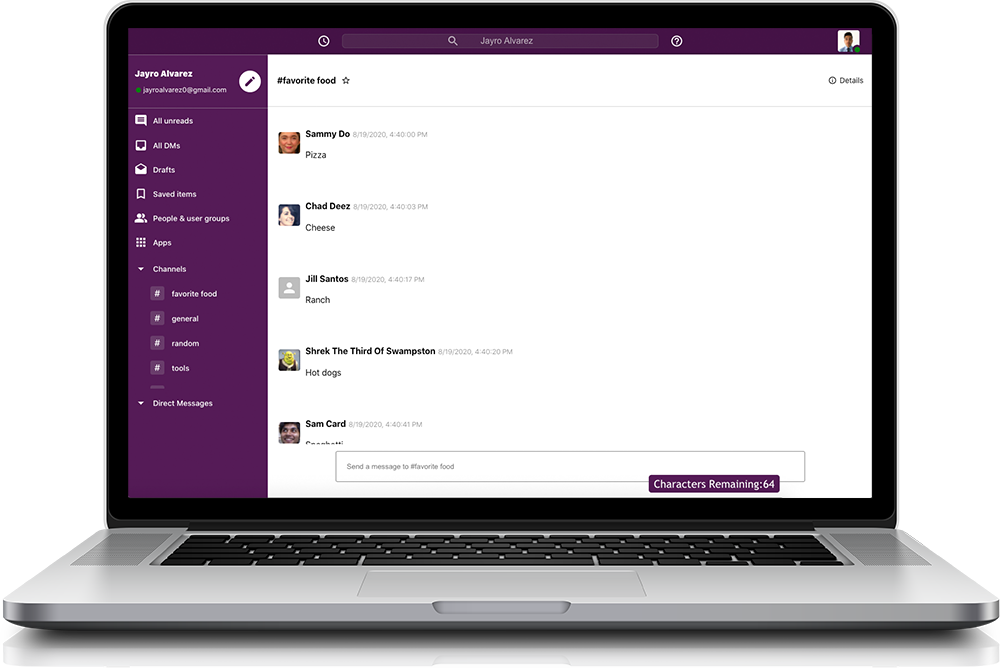

<!-- PROJECT LOGO -->
 

  

  <h3 align="center">Slack Clone</h3>

  

    Securely authenticated users are able to create channels for real-time messaging with other users.
     
    <a href="https://not-slack-297ae.firebaseapp.com/">View Demo</a>

### Built With
* [React](https://reactjs.org/)
* [TypeScript](https://www.typescriptlang.org/)
* [Firebase](https://firebase.google.com/)

